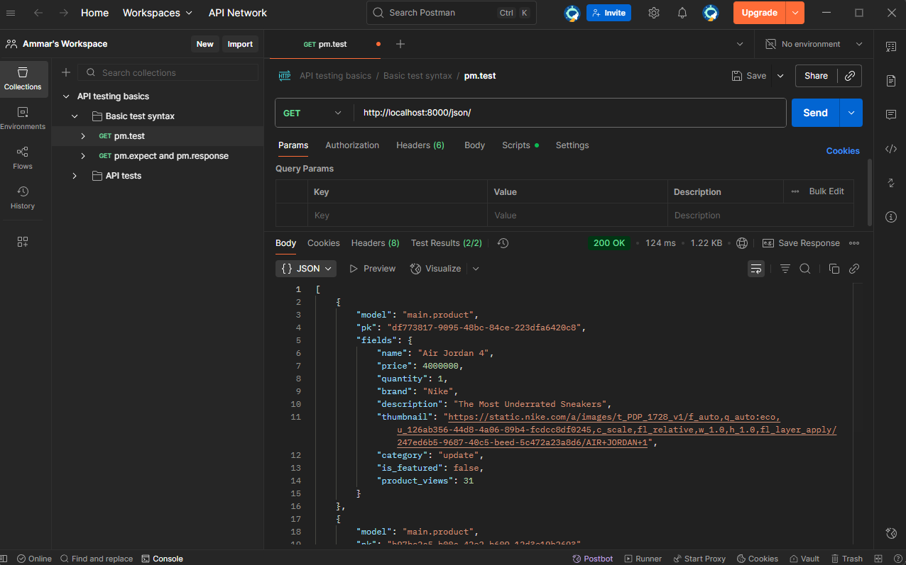

1. Jelaskan mengapa kita memerlukan data delivery dalam pengimplementasian sebuah platform?

dalam sebuah platform, data delivery diperlukan supaya data yang kita miliki di database dapat dikirimkan, di distribusikan yang tentu dengan tepat, cepat, aman, dan konsisten. 

dalam implementasinya data delivery diperlukan karena memudahkan kita dalam melakukan akses database yang kita miliki. Seperti contoh, jika di ddp 2 kita memiliki user, admin, seller, buyer, disini mereka butuh data yang sama tetapi memiliki tampilan yang berbeda sehingga data delivery membantu untuk memastikan semua pihak dapat menerima data sesuai dengan kebutuhannya.

selain memudahkan dalam memberi akses, kita juga perlu memiliki konsistensi dalam mengirimkan data, sehingga tanpa mekanisme data delivery yang baik, platform kita bisa jadi lambat, tidak konsisten, rawan error, dan tidak aman.

2. Menurutmu, mana yang lebih baik antara XML dan JSON? Mengapa JSON lebih populer dibandingkan XML?

dari segi kebahasaan JSON lebih mudah untuk dilihat dibandingkan dengan XML, kemudian JSON dapat lebih cepat melakukan parsing dibandingkan XML. ia juga merupakan bahasa yang ukuran datanya lebih kecil sehingga akan lebih efisien dalam penghematan resource networknya. JSON juga mudah diintegrasikan dengan REST API karena kebanyakan layanan menggunakan JSON, namun dari hal tersebut kita dapat mengetahui bahwa

jika kita ingin membangun sebuah platform yang hanya butuh data sederhana, cepat, dan untuk API/web/mobile maka JSON lebih unggul

Namun, jika kita butuh platform yang lebih kompleks datanya seperti dokumen dengan metadata/validasi skema maka XML masih lebih relevan

3. Jelaskan fungsi dari method is_valid() pada form Django dan mengapa kita membutuhkan method tersebut?

untuk mengetahui mengapa kita membutuhkan method tersebut, kita perlu mengetahui kegunaan dan fungsi dari is_valid(). Pertama is_valid() berfungsi untuk menjadi lapisan proteksi supaya data yang masuk ke database aman, kedua jika form tidak divalidasi maka akan ada kemungkinan terjadinya error di level database atau logic pada program, ketiga is_valid() mengisi form.errors yang bisa ditampilkan kembali di halaman supaya user tahu letak dari kesalahannya, terakhir dengan is_valid(), kita jadi tidak perlu melakukan manual check satu per satu terhadap input, cukup dengan mendefinisikan aturan di form dan Djago yang akan melakukan validasi, sehingga penting untuk kita menggunakan is_valid() guna memvalidasi input user sesuai aturan field Django, menghasilkan data yang clean jika valid dan akan error jika tidak valid hal ini tentu meningkatkan keamanan, konsistensi, dan kemudahan feedback pada user.

4. Mengapa kita membutuhkan csrf_token saat membuat form di Django? Apa yang dapat terjadi jika kita tidak menambahkan csrf_token pada form Django? Bagaimana hal tersebut dapat dimanfaatkan oleh penyerang?

kita memerlukan scrf_token pada django untuk dapat mencegah yang namanya csrf [Cross-Site Request Forgery], yakni serangan dimana penyerang memaksa user mengirim request ke server tanpa sepengetahuan User itu sendiri, sehingga bisa lika tidak menambahkan scrf_ttoken form kita besar kemungkinannya untuk dieksploitasi dengan namanya CSRF attack, penyerang juga bisa membuat page yang berbahaya atau page yang tidak kita inginkan yang bisa secara otomatis mengirim request POST pada aplikasi kita. biasanya penyerang memanfaatkan dengan mengetahui terlebih dahulu endpoint rawan pada user seperti 'delete account', 'trasnfer money', dll. Setelahnya mereka akan membuat page dengan from auto-submit, jika korban membuka halaman tersebut saat login, maka browser akan otomatis mengirim cookie session. Tanpa adanya csrf_token, server dapat mengira request itu sah sehingga akun bisa terhapus atau uang bisa dikirim kepada penyerang.

5. Jelaskan bagaimana cara kamu mengimplementasikan checklist di atas secara step-by-step (bukan hanya sekadar mengikuti tutorial).

pertama saya membuat template base html untuk kerangka dasar kita dalam root folder, kemudian sata membuat perubahan dalam main.html di dalam main/templates dengan mengikuti kerangka yang telah saya buat dalam base.html. setelah hal tersebut selesai saya memodifikasi views.py dengan kebutuhan yang sesuai dengan toko saya, dalam kasus ini menambahkan beberapa funciton untuk dapat memanfaatkan XML dan JSON, setelah modifikasi saya lakukan , saya melakukan konfigurasi pada urls.py di dalam direktri main dengan menambahkan beberapa path dan import yang sesuai dengan yang telah saya ubah dalam views.py

setelah hal tersebut selesai saya melakukan konfigurasi pada main/templates dengan menambahkan berkan create_product dan products_detail, tak lupa terkahir untuk menambahkan CSRF supaya form saya tetap aman dalam penggunaanya.

6. Apakah ada feedback untuk asdos di tutorial 2 yang sudah kalian kerjakan?

tidak banyak, namun terimakasihh telah membantu ketika error saat web menjadi error jika di push pada PWS dimana saya tidak tahu errornya dimana, serta memperkenalkan extension database viewer untuk dapat membaca isi dari database saya

7. 

 --> XML
 --> JSON
